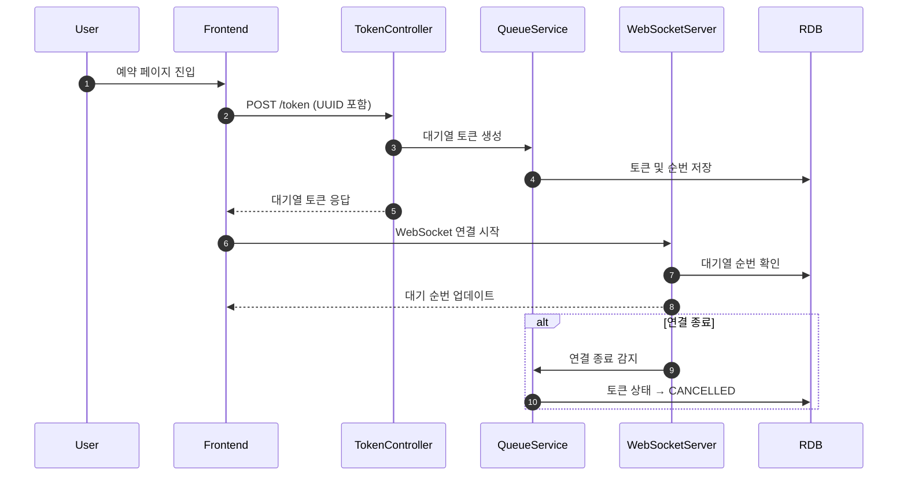
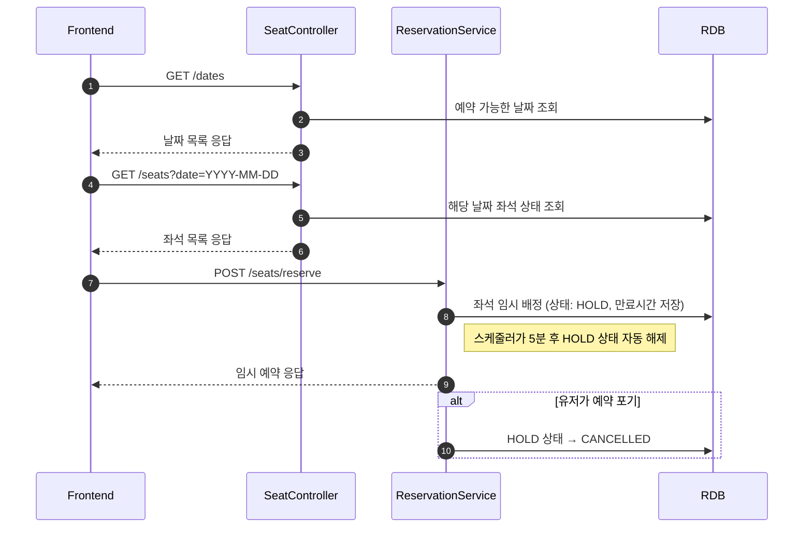
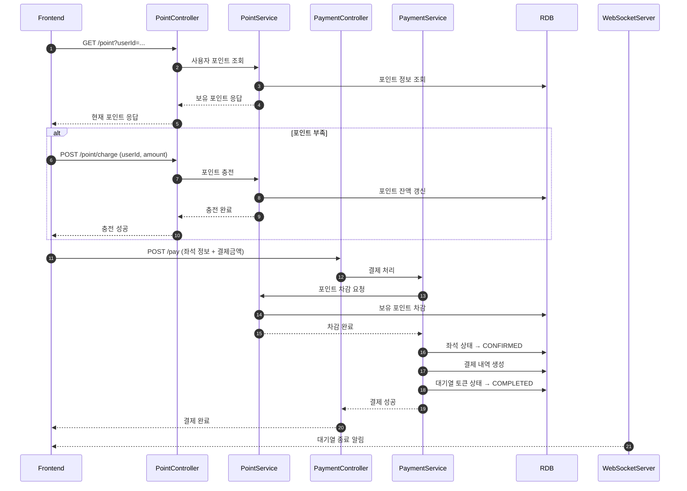
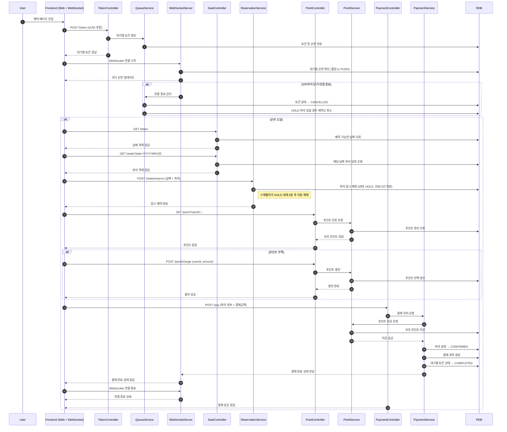
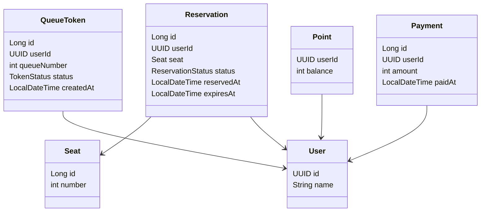
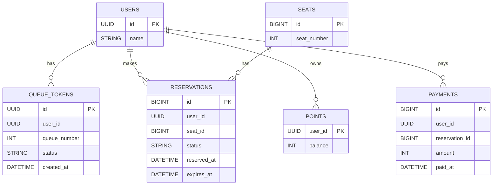

# 프로젝트(콘서트 예약 서비스)

## Getting Started

### Prerequisites

#### Running Docker Containers

`local` profile 로 실행하기 위하여 인프라가 설정되어 있는 Docker 컨테이너를 실행해주셔야 합니다.

```bash
docker-compose up -d
```

## 요구사항

<details>
<summary>요구사항 보기</summary>

### 필수 요구사항

1. 유저 토큰 발급 API
2. 예약 가능 날짜 / 좌석 API
3. 좌석 예약 요청 API
4. 잔액 충전 / 조회 API
5. 결제 API

- 각 기능 및 제약사항에 대해 단위 테스트를 반드시 하나 이상 작성하도록 합니다.
- 다수의 인스턴스로 어플리케이션이 동작하더라도 기능에 문제가 없도록 작성하도록 합니다.
- 동시성 이슈를 고려하여 구현합니다.
- 대기열 개념을 고려해 구현합니다.

### API Specs

1️⃣`주요` 유저 대기열 토큰 기능

- 서비스를 이용할 토큰을 발급받는 API를 작성합니다.
- 토큰은 유저의 UUID 와 해당 유저의 대기열을 관리할 수 있는 정보 ( 대기 순서 or 잔여 시간 등 ) 를 포함합니다.
- 이후 모든 API 는 위 토큰을 이용해 대기열 검증을 통과해야 이용 가능합니다.

> 기본적으로 폴링으로 본인의 대기열을 확인한다고 가정하며, 다른 방안 또한 고려해보고 구현해 볼 수 있습니다.
>> *대기열 토큰 발급 API   
> *대기번호 조회 API

예약이 시작되면 예약 요청을 보내는 모든 유저는 토큰을 대기열 토큰을 받을 수 있으며, 지속적으로 자기의 대기열 번호를 확인 할 수 있어야 한다.(아마도 웹 소켓을 활용할 예정)
토큰에는 유저의 식별자와 유저의 대기열을 관리할 수 있는 정보가 담겨 있어야 한다.
병렬 처리를 위해 특정 유저의 수 만큼 이후 API 를 요청할 수 있다.(이건 아직 미정)

대기열 관리를 어떻게 할것인가?

- 큐에 대기열 순서대로 토큰을 넣어서 관리해야 하나? 일단 redis 는 사용하지 말고 RDB 를 사용해서 큐를 관리하자 요청자 수 만큼 토큰을 생성해서 순서대로 DB 에 적재

2️⃣`기본` 예약 가능 날짜 / 좌석 API

- 예약가능한 날짜와 해당 날짜의 좌석을 조회하는 API 를 각각 작성합니다.
- 예약 가능한 날짜 목록을 조회할 수 있습니다.
- 날짜 정보를 입력받아 예약가능한 좌석정보를 조회할 수 있습니다.

> 좌석 정보는 1 ~ 50 까지의 좌석번호로 관리됩니다.

대기열 토큰을 가지고 예약 가능 날짜 및 죄석을 조회 하는 API 호출
예약 가능 날짜 조회와, 해당 날짜의 좌석을 조회하는 API 를 각각 작성해야 한다.
목록으로 조회 해야 하며, 아마도 페이징 처리 까지는 필요 없을것 같다.
날짜 정보만 입력

3️⃣`주요` 좌석 예약 요청 API

- 날짜와 좌석 정보를 입력받아 좌석을 예약 처리하는 API 를 작성합니다.
- 좌석 예약과 동시에 해당 좌석은 그 유저에게 약 **5분**간 임시 배정됩니다. ( 시간은 정책에 따라 자율적으로 정의합니다. )
- 만약 배정 시간 내에 결제가 완료되지 않는다면 좌석에 대한 임시 배정은 해제되어야 한다.
- 누군가에게 점유된 동안에는 해당 좌석은 다른 사용자가 예약할 수 없어야 한다.

좌석을 예약 처리하는 API 가 필요하며, 예약과 동시에 임시 배정
임시 배정의 경우는 스케쥴러를 사용해서 크론잡으로 해제 하는 방식을 사용하자 (최소 30초)
점유 된 좌석의 경우는 좌석 리스트를 보여줄때 임시 배정으로 보여주고 예약 처리를 할 수 없도록 하자.

4️⃣`기본` 잔액 충전 / 조회 API

- 결제에 사용될 금액을 API 를 통해 충전하는 API 를 작성합니다.
- 사용자 식별자 및 충전할 금액을 받아 잔액을 충전합니다.
- 사용자 식별자를 통해 해당 사용자의 잔액을 조회합니다.

잔액 충전이다.
사용자 식별자를 통해 해당 사용자의 잔액을 조회 한다.
지금 시스템에서는 로그인 회원가입 같은게 없다보니 그냥 API 에서 식별자를 받도록하자.
만약 시간이 있다면 로그인을 가정하여 만들어 볼까?

5️⃣`주요` 결제 API

- 결제 처리하고 결제 내역을 생성하는 API 를 작성합니다.
- 결제가 완료되면 해당 좌석의 소유권을 유저에게 배정하고 대기열 토큰을 만료시킵니다.

결제가 완료되면 소유권을 배정, 대기열 토큰 만료.

</details>

## 시퀀스 다이어그램

### 대기열 진입 및 순번 조회



### 예약 및 임시 배정 흐름



### 포인트 및 결제 흐름



### 전체 흐름



## 클래스 다이어그램



## ERD


