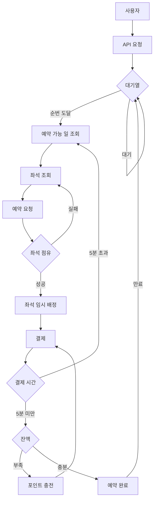
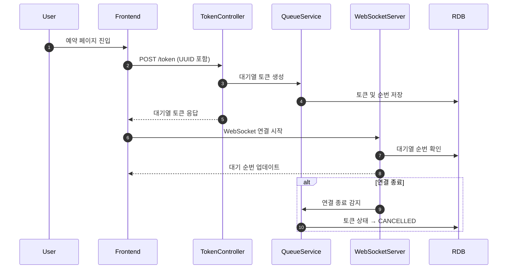
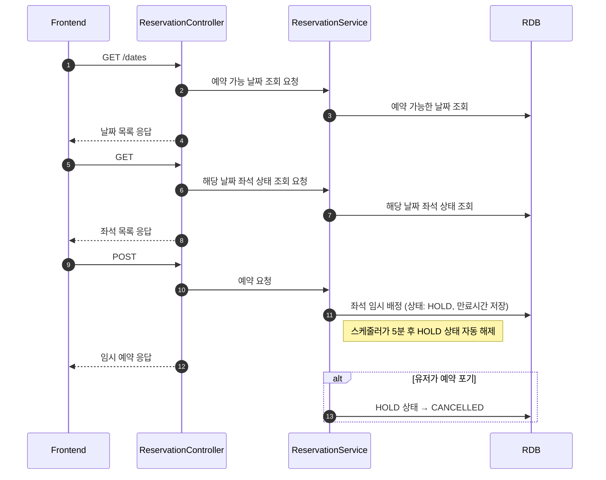
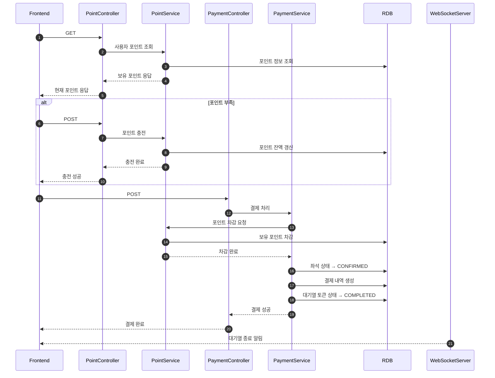
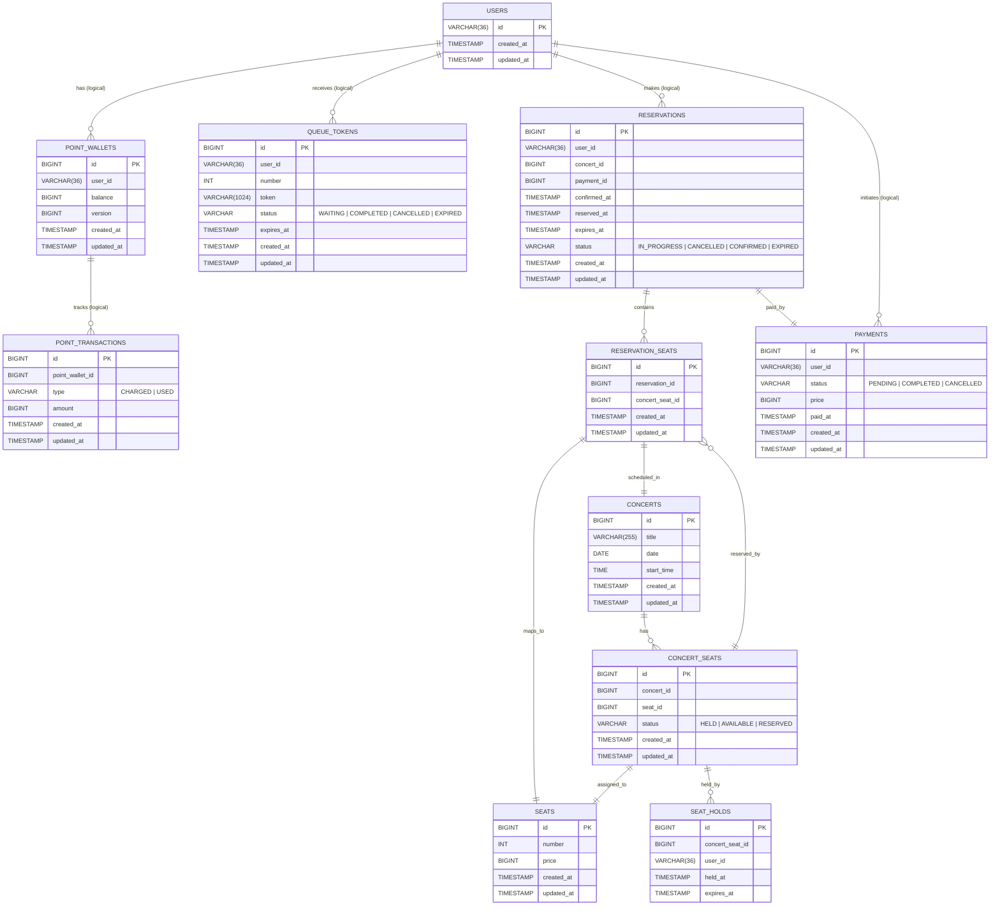

# 프로젝트(콘서트 예약 서비스)

## Getting Started

### Prerequisites

#### Running Docker Containers

`local` profile 로 실행하기 위하여 인프라가 설정되어 있는 Docker 컨테이너를 실행해주셔야 합니다.

```bash
docker-compose up -d
```

## 요구사항

<details>
<summary>요구사항 보기</summary>

### 필수 요구사항

1. 유저 토큰 발급 API
2. 예약 가능 날짜 / 좌석 API
3. 좌석 예약 요청 API
4. 잔액 충전 / 조회 API
5. 결제 API

- 각 기능 및 제약사항에 대해 단위 테스트를 반드시 하나 이상 작성하도록 합니다.
- 다수의 인스턴스로 어플리케이션이 동작하더라도 기능에 문제가 없도록 작성하도록 합니다.
- 동시성 이슈를 고려하여 구현합니다.
- 대기열 개념을 고려해 구현합니다.

### API Specs

1️⃣`주요` 유저 대기열 토큰 기능

- 서비스를 이용할 토큰을 발급받는 API를 작성합니다.
- 토큰은 유저의 UUID 와 해당 유저의 대기열을 관리할 수 있는 정보 ( 대기 순서 or 잔여 시간 등 ) 를 포함합니다.
- 이후 모든 API 는 위 토큰을 이용해 대기열 검증을 통과해야 이용 가능합니다.

> 기본적으로 폴링으로 본인의 대기열을 확인한다고 가정하며, 다른 방안 또한 고려해보고 구현해 볼 수 있습니다.
>> *대기열 토큰 발급 API   
> *대기번호 조회 API

예약이 시작되면 예약 요청을 보내는 모든 유저는 토큰을 대기열 토큰을 받을 수 있으며, 지속적으로 자기의 대기열 번호를 확인 할 수 있어야 한다.(아마도 웹 소켓을 활용할 예정)
토큰에는 유저의 식별자와 유저의 대기열을 관리할 수 있는 정보가 담겨 있어야 한다.
병렬 처리를 위해 특정 유저의 수 만큼 이후 API 를 요청할 수 있다.(이건 아직 미정)

대기열 관리를 어떻게 할것인가?

- 큐에 대기열 순서대로 토큰을 넣어서 관리해야 하나? 일단 redis 는 사용하지 말고 RDB 를 사용해서 큐를 관리하자 요청자 수 만큼 토큰을 생성해서 순서대로 DB 에 적재

2️⃣`기본` 예약 가능 날짜 / 좌석 API

- 예약가능한 날짜와 해당 날짜의 좌석을 조회하는 API 를 각각 작성합니다.
- 예약 가능한 날짜 목록을 조회할 수 있습니다.
- 날짜 정보를 입력받아 예약가능한 좌석정보를 조회할 수 있습니다.

> 좌석 정보는 1 ~ 50 까지의 좌석번호로 관리됩니다.

대기열 토큰을 가지고 예약 가능 날짜 및 죄석을 조회 하는 API 호출
예약 가능 날짜 조회와, 해당 날짜의 좌석을 조회하는 API 를 각각 작성해야 한다.
목록으로 조회 해야 하며, 아마도 페이징 처리 까지는 필요 없을것 같다.
날짜 정보만 입력

3️⃣`주요` 좌석 예약 요청 API

- 날짜와 좌석 정보를 입력받아 좌석을 예약 처리하는 API 를 작성합니다.
- 좌석 예약과 동시에 해당 좌석은 그 유저에게 약 **5분**간 임시 배정됩니다. ( 시간은 정책에 따라 자율적으로 정의합니다. )
- 만약 배정 시간 내에 결제가 완료되지 않는다면 좌석에 대한 임시 배정은 해제되어야 한다.
- 누군가에게 점유된 동안에는 해당 좌석은 다른 사용자가 예약할 수 없어야 한다.

좌석을 예약 처리하는 API 가 필요하며, 예약과 동시에 임시 배정
임시 배정의 경우는 스케쥴러를 사용해서 크론잡으로 해제 하는 방식을 사용하자 (최소 30초)
점유 된 좌석의 경우는 좌석 리스트를 보여줄때 임시 배정으로 보여주고 예약 처리를 할 수 없도록 하자.

4️⃣`기본` 잔액 충전 / 조회 API

- 결제에 사용될 금액을 API 를 통해 충전하는 API 를 작성합니다.
- 사용자 식별자 및 충전할 금액을 받아 잔액을 충전합니다.
- 사용자 식별자를 통해 해당 사용자의 잔액을 조회합니다.

잔액 충전이다.
사용자 식별자를 통해 해당 사용자의 잔액을 조회 한다.
지금 시스템에서는 로그인 회원가입 같은게 없다보니 그냥 API 에서 식별자를 받도록하자.
만약 시간이 있다면 로그인을 가정하여 만들어 볼까?

5️⃣`주요` 결제 API

- 결제 처리하고 결제 내역을 생성하는 API 를 작성합니다.
- 결제가 완료되면 해당 좌석의 소유권을 유저에게 배정하고 대기열 토큰을 만료시킵니다.

결제가 완료되면 소유권을 배정, 대기열 토큰 만료.

</details>

<details>
<summary>주차별 피드백</summary>

### 2주차 피드백

```text
- 좋았던 점
    - 별도의 png로도 올려주셔서 보는 사람 입장에서 과제 제출되었다고 생각이 들었어요
    - 낙관적 잠금을 고려한 wallet 테이블 분리 좋아요, 확실한 의도가 있는 분리! + 거래 이력에 대한 관리까지 고민하신 부분도 좋습니다
    - internal 키워드 꼼꼼히 붙여주시는군요ㅎㅎ
    - date와 같은 데이터 필터링 용도로 쿼리 파라미터도 적절하게 사용하신 것 같아요
- 아쉬웠던 점
    - 이 케이스에서 굳이 WebSocket을 사용할 필요까지는 없지 않았을까 싶네요!
    - 실패 케이스 중에서도 핵심 부분은 남겨도 괜찮지 않을까 싶어요, 예를 들어 토큰 조회 실패 같은 부분 말고요!
    - 브라우저 닫기와 같은 부분은 조금 많이 상세했던 것 같네요!
    - MySQL 기준으로 데이터베이스의 [클러스터링 인덱스 구조](https://mangkyu.tistory.com/285)에 대해 알아보시면 좋을 것 같아요, 그리고 왜 PK는 Long 타입 정수형으로 선언하면 좋은지 고민해보기. PK 문자열 사용에 대한 참고 자료: https://kccoder.com/mysql/uuid-vs-int-insert-performance/
    - queue_tokens에서 number는 너무 모호한 네이밍의 컬럼인 것 같아요
    - reservation과 reservation_seats를 굳이 분리할 필요가 있을까 라는 생각이 당장은 드는데, 코드를 보고 작업하면서 다시 살펴보면 좋겠네요!
    - /api/reservations/{id}/payment/points를 기준으로 리소스 계층 구조는 잘 잡아주신 것 같은데, 결제 수단은 굳이 path에 표현되지 않아도 되는 것 같아요, 이것은 리소스 계층보다는 수단 중 하나의 개념이라
    - 저라면 /api/reservations/available-dates는 반대로 어떤 콘서트에 대한 예약 정보인지, 콘서트 정보를 path에 노출시킬 것 같아요
    - 유효성 검사 부분은 spring-boot-validation을 저는 사용하기를 선호합니다!
- 리뷰 피드백
    - ERD 관련 부분 위에서 코멘트 남겨드렸습니다
    - 설계 문서 코멘트도 위에서 남겨드렸습니다.
    - API Path 설계 부분은 위에서 코멘트 남겨드렸습니다!
    - 말씀해주신대로 ControllerTest를 통해 문서화를 작성시키는 방법이 있어서, 둘을 합칠 수 있는 방법으로 고도화해보시면 좋을 것 같아요
```

### 피드백 수정 내용

#### 설계

- 설계 부분은 직접적인 수정은 하지 않고, 다시 한번 생각 해 보는 방식으로 피드백을 수용하자.
- [x] 웹 소켓 사용에 대한 생각
  - 대기열이 실시간으로 줄어드는걸 보여줄 필요가 없었던걸까? 만약 그런거라면 빼도 될것 같다.
- [x] 시퀀스 다이어 그램에서 핵심적인 예외 부분은 남겨도 좋을것 같다.
  - 너무 간소화 시킨 것 같다. 사실 아직 구현단계 전이라 그런가 어떤게 핵심적인 예외 발생 부분인지 잘은 모르겠다.
- [x] 브라우저 닫기 등의 내용은 너무 상세한 것 같다.
  - 웹 소켓을 생각할 필요가 없다면 이 부분도 빼도 될것 같다.
- [x] 클러스터링 인덱스 구조에 대해 학습
  - 일단 이번주차에 DB를 사용하지 않으니까, 이번주 금요일 과제 제출 하고 공부해보자.
- [x] PK 는 왜 Long 타입 정수형으로 선언하면 좋은지 고민해보기.
  - 일단 이번주차에 DB를 사용하지 않으니까, 이번주 금요일 과제 제출 하고 공부해보자. 
- [x] 모호한 컬럼 네이밍 수정
  - number 보다는 queueNumber? 가 좋으려나..
- [x] URL Path 수정
  - 이것도 나중에 깨달은 부분인데 시간이 없어 수정이 어려웠다.. /api/reservation/available-dates -> /api/concerts/{id}/reservation/available-dates 가 좋았을것 같다.
  - 예약 Controller 에 있는게 아니라 Concert Controller 에 있어야겠지?
  - Seat 관련된 URL 로 Reservation 에 있는데 옮겨야겠다.

#### Mock API

- Mock API 에서 어디까지 작성해야 하는지 그 기준이 모호 했었는데, 너무 작게 잡은것 같다. 응답 관련된 부분은 전부 작성하는게 좋은것 같다.(예외, Validation 등등)
- [x] 커스텀 예외 응답 추가
- [x] Validation 추가

### 3주차 피드백

- 이거 어디갔지??

### 4주차 피드백

```text
- 좋았던 점
    - 테이블 PK에 AUTO_INCREMENT 잘 반영해주셨네요
    - 클러스터 인덱스에 대해 이해하고, 별도 인덱스를 중복 생성하지 않은 부분 좋았습니다
    - 보고서 작성도 잘 해주신 것 같아요, 참고로 실제 성능 테스트를 해보려면 최소한 몇 백만 건의 데이터가 필요하므로 추후에는 더 많은 데이터로도 해보시면 좋을 것 같아요
    - 영속성 관련 작업인데, 별도의 다른 계층에 대한 전파가 많이 없었던 것 같아요. 이를 통해 계층 격리를 잘 해주셨음을 파악할 수 있었습니다.
- 아쉬웠던 점
    - status VARCHAR(20) NOT NULL CHECK (status IN ('HELD', 'AVAILABLE', 'RESERVED'))과 같이 문자열 검사를 넣어주셨는데, 애플리케이션에서 Enum 타입을 사용하면 타입 검사가 알아서 되기 때문에 굳이 추가할 필요는 없을 것 같아요
    - PaymentJdbcRepository와 같은 부분은 별도의 클래스로 분리할 필요가 없을 것 같아요, 추가로 SpringDataJpa의 Query 애노테이션을 통해서도 처리할 수 있을 것 같아요
    - 개인적인 견해로는 JdbcRepository 로직을 보니 SpringDataJpa로도 충분히 대체 가능해보이는데, Jdbc를 추가로 사용하신 이유가 있을까요? 없다면 SpringDataJpa 만으로도 일관성있게 처리하면 좋을 것 같아요. 물론 실무에서도 요구에 따라 SpringDataJpa를 기본으로 사용하고 Jdbc도 사용하기도 합니다.
    - ReservationOrchestratorTest 잘 작성해주셨는데, 새롭게 의존하는 대상이 생기면 해당 테스트도 깨질 것 같네요
    - ReservationOrchestratorTest와 ReservationOrchestratorIntegrationTest를 모두 별개로 작성하면 테스트 간에 중복인 것 같아서, 보다 효율적으로 작성할 수 있을 것 같아요. 물론 연습하는 과정에서는 매우 훌륭한 시도라고 생각합니다.
    - Junit5의 assertAll, ParamterizedTest, assertThat(리스트).hasSize 에 대해 학습해보기
- 기타 피드백
    - 
- 리뷰
    - 먼저 모든 테스트를 작성할 필요는 없고, 핵심이 되는 부분에 대한 테스트만 작성하는 것이 바람직하다고 생각합니다. 그리고 그 대상이 통합 테스트라면 컨트롤러부터 시작되는 입력으로 끝까지 검증시켜, 중간에 Service 계층에 대한 부분은 생략해도 괜찮다고 생각합니다. 관련된 내용은 공유드린 학습 컨텐츠를 참고하시면 보다 도움이 되실 것 같아요. 무엇보다 중요한 것은 테스트가 가치가 있어야 하는 것 같아요, 가치 없이 무분별하게 작성되는 테스트는 오히려 유지보수 비용을 증가시킬 수 있습니다.
    - 위에 적어두긴 했지만, 데이터의 양이 많지 않다면 그리고 데이터의 양에 따라서 쿼리 실행 계획이 매우 달라질 수 있습니다. 이를 위해 많은 양의 데이터를 추가하여 실행 계획을 살펴볼 필요가 있고, 실제 운영 환경에서는 데이터가 많기에 이런 식으로 테스트하면서 개선하는 작업이 필요합니다.
```

#### 피드백 수정 내용

- [x] assertAll, ParamterizedTest, assertThat(리스트).hasSize 에 대해 학습.
- [x] 테스트 데이터 좀 더 많이 넣고, 성능 테스트 해보기.
    - 테스트 데이터를 더 많이 넣으니 OOM 발생, 그리고 소요 시간이 너무 오래 걸리는 문제 발생 최적화 필요
    - OOM 해결, 소요 시간은 5분정도 소요
- [x] jdbc 사용 관련, 흠흠.. 이건 피드백 받을 줄 알고 있었는데. 의도한거니까 일단은 냅두자.


### 5주차 피드백

```text
- 동시성 문제가 발생하고 있는 부분을 해결해야 하는데, 근본적으로는 현재 대기열 토큰 발급 로직 자체가 조금은 부실한것 같다. 이런식의 토큰 발급과 검증은 설계상 조금은 아쉬운 부분이 존재하는것 같다.
다만, 현재 설계를 변경하기에는 조금 어려운 부분들이 있기 때문에 문제 상황을 빠르게 해결할 수 있는 방법으로 접근해야 할것 같다.
  -> 문제를 파악하고 원인분석을하는것은 좋은습관입니다. 이왕이면 해결까지! 
  -> 설계의 문제를 인지한 시점부터 빠른 수정필요 
  -> 대기열의 설계로써는 대기열 테이블과 active 테이블을 별도로 두고 일정 시간 간격마다 active 로 이동시키고 대기열 테이블에서 제외시켜주는 방식으로 설계하면 토큰 발급의 동시성 이슈를 해결할 수 있습니다.

- 비관적락 중 요청 순서나 트랜잭션 순서를 엄격하게 보장해야 한다
   -> 낙관적락도 요청 순서 및 트랜젝션 순서를 보장되도록 할 수 있습니다.
    그것보다 더 중요한 관점은 재시도가 필요하냐 안하냐와 경합이 많이 발생하냐 안하냐의 기준으로 초점을 맞추는게 더 적절해요

- 락 적용 확인
- 동시성 테스트 확인
```

#### 피드백 수정 내용

- [x] 대기열 토큰 발급 기능 로직 수정
  - 이건 MQ 를 사용하는 시점에 로직을 수정하게 될것 같은데, 그 전에라도 시간이 된다면 수정해보자 우선 어떤식으로 설계해야하고 수정해야 하는지는 이해 완료
- [x] 비관적락 이랑 낙관적락 체크 리스트를 조금 수정해봐야 할것 같다.
  - 재시도와 경합을 초점으로 맞춰서

</details>

## 플로우 차트



## 시퀀스 다이어그램

### 대기열 진입 및 순번 조회



### 예약 및 임시 배정 흐름



### 포인트 및 결제 흐름



### 전체 흐름

```mermaid
sequenceDiagram
    autonumber
    participant User
    participant FE as Frontend (Web + WebSocket)
    participant TokenAPI as TokenController
    participant QueueService
    participant WS as WebSocketServer
    participant SeatAPI as ReservationController
    participant ReserveService as ReservationService
    participant PointAPI as PointController
    participant PointService
    participant PayAPI as PaymentController
    participant PaymentService
    participant DB as RDB
%% --- 대기열 진입 및 WebSocket 연결 ---
    User ->> FE: 예약 페이지 진입
    FE ->> TokenAPI: POST (UUID 포함)
    TokenAPI ->> QueueService: 대기열 토큰 생성
    QueueService ->> DB: 토큰 및 순번 저장
    TokenAPI -->> FE: 대기열 토큰 응답
    FE ->> WS: WebSocket 연결 시작
    WS ->> DB: 대기열 순번 확인 (폴링 or PUSH)
    WS -->> FE: 대기 순번 업데이트

    alt 브라우저 닫기/연결 종료
        WS ->> QueueService: 연결 종료 감지
        QueueService ->> DB: 토큰 상태 → CANCELLED
        QueueService ->> DB: HOLD 좌석 있을 경우 예약도 취소
    end

    alt 순번 도달
    %% --- 좌석 예약 흐름 ---
        FE ->> SeatAPI: GET
        SeatAPI ->> DB: 예약 가능한 날짜 조회
        SeatAPI -->> FE: 날짜 목록 응답
        FE ->> SeatAPI: GET
        SeatAPI ->> DB: 해당 날짜 좌석 상태 조회
        SeatAPI -->> FE: 좌석 목록 응답
        FE ->> ReserveService: POST
        ReserveService ->> DB: 좌석 임시 배정 (상태: HOLD, 만료시간 저장)
        ReserveService -->> FE: 임시 예약 완료
    %% --- 포인트 조회 및 충전 ---
        FE ->> PointAPI: GET
        PointAPI ->> PointService: 포인트 조회 요청
        PointService ->> DB: 포인트 정보 조회
        PointService -->> PointAPI: 보유 포인트 응답
        PointAPI -->> FE: 포인트 응답

        alt 포인트 부족
            FE ->> PointAPI: POST
            PointAPI ->> PointService: 포인트 충전
            PointService ->> DB: 포인트 잔액 갱신
            PointService -->> PointAPI: 충전 완료
            PointAPI -->> FE: 충전 성공
        end

    %% --- 결제 흐름 ---
        FE ->> PayAPI: POST
        PayAPI ->> PaymentService: 결제 처리 요청
        PaymentService ->> PointService: 포인트 차감 요청
        PointService ->> DB: 보유 포인트 차감
        PointService -->> PaymentService: 차감 성공
        PaymentService ->> DB: 좌석 상태 → CONFIRMED
        PaymentService ->> DB: 결제 내역 생성
        PaymentService ->> DB: 대기열 토큰 상태 → COMPLETED
        PaymentService -->> WS: 결제 완료 상태 전송
        WS -->> FE: 결제 완료 상태 응답
        FE ->> WS: WebSocket 연결 종료
        WS -->> FE: 연결 종료 완료
        PayAPI -->> FE: 결제 성공 응답
    end
```



## ERD


